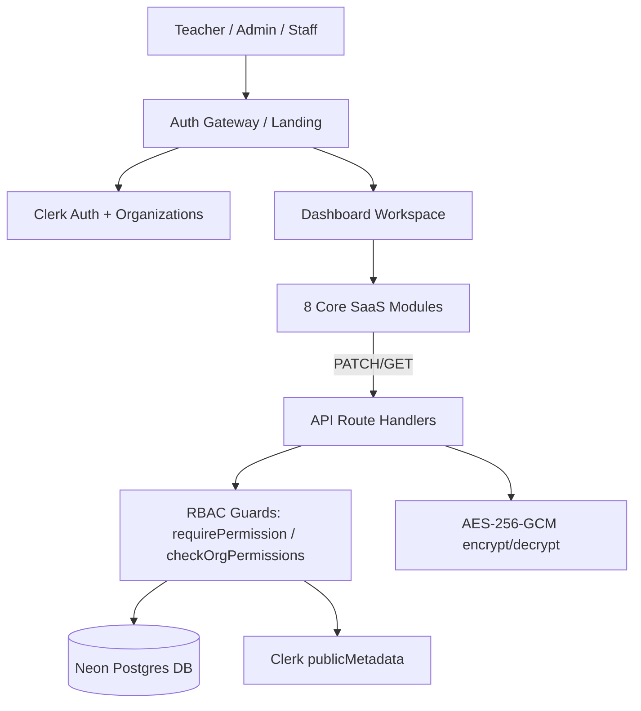

# DocentBase — Complete Project Overview

> **Purpose:** This document gives any agent a complete mental model of the DocentBase project (`docent-dashboard-v2`): what it is, who it serves, the business model, the architecture, the feature set, the data model, and how it is built/deployed. Read this before writing any code.

---

## 1. What DocentBase Is

**DocentBase is a multi-tenant B2B SaaS operating system ("Dashboard OS") for coaching centers / private tutors / tuition academies in Bangladesh.**

It replaces the fragmented tools (paper registers, Excel sheets, WhatsApp groups, manual bKash tracking) that small to mid-size coaching centers currently use, with one unified web dashboard covering:

- Student directory & enrollment
- Batch / class scheduling
- Rapid daily attendance logging (+ USI cross-batch tracking)
- Monthly tuition fee collection & tracking
- Online payment gateways (bKash / Nagad / SSLCommerz)
- Automated parent SMS / WhatsApp notifications
- Monthly parent progress reports
- Staff / team / role management
- 24/7 "white-glove" human support desk

The product lives on a **dashboard subdomain** (e.g. `dashboard.*`), while the main marketing site is `docentbase.com`.

---

## 2. Business Model

| Aspect | Detail |
|---|---|
| **Type** | Multi-tenant B2B SaaS (recurring subscription) |
| **Customer** | Coaching center owners / admin staff in Bangladesh |
| **Monetization** | Subscription plans (Free / Pro / Premium). Features are gated by plan via feature flags in org metadata + `<PlanGate>` upsell UI + `UpgradeModal`. |
| **Revenue levers (vision)** | Subscription tiers, online gateway platform fee (e.g. ~1.5% per transaction routed through DocentBase merchant account), premium add-ons (data entry as a service, on-site support) |
| **TAM context** | Bangladesh has thousands of coaching centers (coaching, tuition batch, school/academy) across metropolitan, district town, upazila, and rural areas. Payment ecosystem is dominated by **bKash** and **Nagad** mobile money. |
| **Differentiation** | Extreme friction removal (attendance in <3s, one-tap fee clearance), parent SMS automation, USI cross-batch detection, white-glove human support (data entry + on-site visits), and a Bangladesh-first UX (Bangla language support, local payment rails). |

---

## 3. Tech Stack

| Layer | Technology |
|---|---|
| **Framework** | Next.js 14 (App Router, React 18, TypeScript) |
| **Auth & Multi-tenancy** | Clerk Organizations + Custom Roles + Custom Permissions (JWT-only authorization, no auth DB) |
| **Database** | Neon Postgres (serverless, HTTP via `@neondatabase/serverless`) |
| **Styling** | Tailwind CSS 3 + Framer Motion (all animations) + lucide-react icons |
| **Theming** | Custom `ThemeProvider` with 11 preset accent themes + dark/light mode (localStorage) |
| **Edge runtime** | Cloudflare Workers via `@opennextjs/cloudflare` (OpenNext) |
| **Deploy** | Wrangler → Cloudflare Workers/Pages (`npm run deploy`) |
| **Encryption** | AES-256-GCM (`node:crypto`) for sensitive fields at rest |
| **Testing** | `npm test` — lightweight self-executing TSX scripts (no framework) |
| **File uploads** | `POST /api/upload` (currently base64 data-URL; R2 is the intended target) |

---

## 4. Architecture Overview



### 4.1 Frontend — single-page dashboard shell

`DashboardView.tsx` is the app shell: persistent collapsible tree **Sidebar**, sticky header, **Command Palette (⌘K)** global search, and 8 tabbed modules with animated transitions. Modules render into `main` based on `activeTab`.

### 4.2 Backend — Next.js Route Handlers

All server logic is Next.js API route handlers under `src/app/api/...`. Every handler independently verifies authorization via:

- `requirePermission(permission, orgId)` — throws 401/403. (`src/lib/auth/requirePermission.ts`)
- `checkOrgPermissions(orgId)` — returns view/manage flags. (`src/lib/rbac.ts`)
- `assertOwnerProtection()` — blocks admins from demoting/removing the org Owner.

### 4.3 Data split — "what goes where"

- **Clerk `Organization.publicMetadata`** → small, flat, UI/JWT-relevant flags (institution type, location type, languages, attendance method, feature flags, plan/subscription, limits, branding).
- **Neon Postgres** → operational, relational, and private data (`organizations`, `academic_info`, `batches`, `organization_join_requests`, `organization_join_blocks`). Source of truth.
- **Sensitive fields** (owner NID, bKash/Nagad/bank accounts) → AES-256-GCM encrypted at rest, decrypted/redacted per role on read.

---

## 5. Directory Structure (source)

```
src/
├── app/                        # Next.js App Router pages & API routes
│   ├── page.tsx                # LandingGateway + gateway state machine (/) 
│   ├── layout.tsx              # ClerkProvider + ThemeProvider
│   ├── dashboard/
│   │   ├── page.tsx            # Dashboard state machine (no-orgs / org-picker / workspace)
│   │   └── join-organization/  # Join-code self-service request page
│   ├── settings/page.tsx       # Organization settings page
│   ├── users/page.tsx          # Dedicated Team & Users page
│   ├── students/page.tsx       # Dedicated Student Directory page
│   └── api/
│       ├── organizations/[orgId]/settings/...   # GET/PATCH settings
│       ├── organizations/[orgId]/join-code/...  # GET/POST join code
│       ├── organizations/[orgId]/join-requests/... # GET list / PATCH act
│       ├── organizations/join-requests/...      # POST submit / GET mine
│       └── upload/route.ts     # file upload (base64 data URL)
├── components/
│   ├── auth/                   # <Can> (role gate) + <PlanGate> (plan teaser)
│   ├── billing/UpgradeModal    # plan upsell modal
│   ├── dashboard/
│   │   ├── DashboardView.tsx   # app shell + tab orchestration
│   │   ├── Sidebar.tsx         # tree navigation + Clerk org switcher
│   │   ├── CommandPalette.tsx  # ⌘K global search / command system
│   │   ├── modules/            # the 8 feature modules
│   │   └── settings/           # OrgSettingsForm + JoinCodeSettingsSection
│   ├── gateway/                # LandingGateway, NoOrgsGateway, OrgPickerGateway, GatewayBackground
│   └── theme/                  # ThemeProvider (11 presets) + ThemeSwitcher
├── lib/
│   ├── auth/                   # can.ts, clerk.ts, permissions.ts, roles.ts, requirePermission.ts
│   ├── org/useOrgMetadata.ts   # 2-min TTL cached org metadata hook
│   ├── crypto.ts               # AES-256-GCM
│   ├── db.ts                   # neon client + ensureJoinSchema
│   ├── join-code.ts            # join-code generate/validate rules
│   └── rbac.ts                 # server permission checker
├── types/settings.ts           # OrgSettingsFormState + related types
├── middleware.ts               # route-level protection (/settings)
└── __tests__/                  # gateway-states + settings-split tests
```

---

## 6. The 8 Core SaaS Modules

> **IMPORTANT — current implementation status:** Modules **2, 3, 4, 6, 7, 8** below are currently **frontend mock/UI demonstrations** (in-memory React state, sample data, simulated SMS/report actions). Modules **1 & 5** (Students directory partially, Team & Users) and the **Settings / Join Code / Join Request / RBAC systems** are wired to **real APIs, Clerk, and Postgres**. When agents extend these, keep this status in mind — the dashboard modules are the product vision; the settings/RBAC/join systems are production-grade.

### 6.1 Control Center Overview (`overview`)
Stat cards (active students, attendance %, monthly collection), sub-filters (All/Active/Fee Due/Archived), recent activity + fee log table with contextual row action menus (view profile, log fee receipt, send SMS). Sample data.

### 6.2 Student Directory (`students`) — real page at `/students`
`StudentsManagementModule.tsx` — search by name/ID/guardian/phone, batch & fee-status filters, Add Student modal (gated by `student:create`), details drawer, Call/SMS guardian quick actions, CSV export. **Currently mock data + local state** (no students table in DB yet). RBAC-gated via `<Can permission="student:view">`.

### 6.3 Team Members & Users (`users`) — real, Clerk-backed, page at `/users`
`UsersManagementModule.tsx` — live Clerk org members + pending email invitations, **8 custom roles** with badge icons, real email invite flow (`organization.inviteMember`), change-role modal (all 8 roles), remove member, revoke invite. Plus a **Pending Join Requests** sub-tab wired to the join-request API (approve-with-role / reject / block).

### 6.4 Monthly Payment Hub (`payments`)
`PaymentWorkflowModule.tsx` — multi-identifier search (name/roll/phone/USI/batch), quick-action buttons `[Paid] [Unpaid] [Next Month] [Reminder] [No More]`, configurable grace-period range (10th/15th/20th) generating an Unpaid List, scheduled reminder modal with promised date, simulated automated parent SMS on clearance. Mock data.

### 6.5 Rapid Attendance & Ratings (`attendance`)
`AttendanceLoggerModule.tsx` — swipe/tap attendance cards (Present/Absent), **10-point homework rating** per student, USI scan-in that auto-detects **cross-batch swaps** (logs late/morning students into the active session), 4 input modes (phone tap / fingerprint / QR / paper). Mock data.

### 6.6 Online Payment Gateways (`online_payments`)
`OnlinePaymentModule.tsx` — two paths:
- **Path A (Manual):** personal bKash/Nagad numbers displayed for manual verification.
- **Path B (Full Automation):** SSLCommerz/bKash merchant webhook interceptor → auto-clears fee + parent SMS + routes net funds to bank account minus platform fee (~1.5%). Simulated webhook log UI. Mock data.

### 6.7 Parent Monthly Reports (`reports`)
`MonthlyReportModule.tsx` — compiles attendance %, homework rating avg, model-test score, and academic status into a monthly parent progress card, dispatch to 128 parents via SMS & WhatsApp (simulated), PDF download (simulated). Mock data.

### 6.8 24/7 White-Glove Support Desk (`support`)
`WhiteGloveSupportModule.tsx` — **Data Entry as a Service** (upload paper roster/Excel for 500+ student insertion by human team) + **On-Site Engineering Visit** request (ZKTeco/network/hardware setup dispatch) + 24/7 hotline. Mock state toggles.

---

## 7. Navigation & Command System

- **Tree-style Sidebar** (`Sidebar.tsx`): collapsible sub-menus under every primary module, permission-gated items (`Can`), Clerk `OrganizationSwitcher`, collapsible to icon rail.
- **Command Palette** (`CommandPalette.tsx`): global `⌘K` / `Ctrl+K`. Indexes primary modules (roots first) + nested sub-functions (`↳` deep links) with keyword aliases (`pending`, `invite`, `members`, `join code`, `roles`, `grace period`, `usi`, `bkash`, `pdf`, theme names). Supports arrow-key navigation and theme switching. Shortcuts like `⌘1..⌘6`, `⌘J`, `⌘I`, `⌘D`, `⌘,`.
- **Themes**: 11 accent presets (Modern SaaS, Shopify, Vercel, Cloudflare, Stripe, Linear, Notion, Teal, Deep Blue, Soft Purple, Orange) × dark/light, persisted in localStorage.

---

## 8. Auth, Multi-Tenancy & RBAC

### 8.1 Identity & Organizations (Clerk)
- Auth: Clerk (email/password, social, OAuth) via modal sign-in/up.
- Multi-tenancy: **Clerk Organizations** = coaching centers. One session = one **active organization** (set via `setActive({ organization })`).
- Roles & permissions live in Clerk as custom roles/permissions; they are read **from the session JWT on every request** (no network call, no DB).

### 8.2 The 8 custom roles
| Key | Label |
|---|---|
| `org:admin` | Owner / Admin (full access) |
| `org:manager` | Operations Manager |
| `org:teacher` | Academic Teacher |
| `org:receptionist` | Receptionist |
| `org:accountant` | Accountant |
| `org:website_manager` | Website Manager |
| `org:viewer` | Read-only Viewer |
| `org:member` | General Staff |

### 8.3 Permissions catalog (`src/lib/auth/permissions.ts`)
42 permissions in `module:action` format covering Org, Members, Students, Batches, Attendance, Payments, Notices, Notes, Exams, Website, Reports. Example: `student:create`, `payment:mark_paid`, `member:invite`, `org:settings`, `report:export`.

### 8.4 Enforcement layers
1. **`<Can permission>`** (`src/components/auth/Can.tsx`) — hides UI elements by role. UI-only; never a security boundary.
2. **`<PlanGate feature>`** (`src/components/auth/PlanGate.tsx`) — shows a locked teaser + Upgrade modal when a plan feature flag is off. Wrap *inside* `<Can>` (role first, plan second).
3. **`requirePermission()`** — server guard returning 401/403.
4. **`checkOrgPermissions()`** — server helper returning `hasManagePermission` / `hasViewPermission`.
5. **`assertOwnerProtection()`** — app-level guard: Owner cannot be demoted/removed by admins.
6. **`middleware.ts`** — route-group protection (`/settings` requires `org:settings`).

### 8.5 Feature/plan flags & limits
Org `publicMetadata` (via `useOrgMetadata`, 2-min TTL cache) carries:
```json
{
  "app": { "onboardingCompleted": true },
  "institution": { "type": "...", "defaultLanguage": "bn", "timezone": "Asia/Dhaka", "currency": "BDT" },
  "subscription": { "plan": "pro", "status": "active", "billingCycle": "monthly", "trial": false },
  "features": { "paymentGateway": true, "sms": true },
  "limits": { "students": 500, "teachers": 50, "batches": 20, "storageGB": 10 },
  "branding": { "theme": "...", "primaryColor": "#...", "darkMode": true }
}
```

---

## 9. Database Schema (Neon Postgres)

Migrations in `db/migrations/`. `ensureJoinSchema()` in `src/lib/db.ts` auto-creates the join-code/requests tables at runtime as a fallback.

### `organizations`
One row per Clerk org (`id` = Clerk `org_...`). Holds contact/social, owner + payment accounts (encrypted `*_encrypted` columns), logo/photos/QR, and JSONB configs (`fee_policy`, `attendance_device_config`, `report_preferences`), plus `join_code` (unique) and `join_code_updated_at`.

### `academic_info`
One row per org: `levels_class_range`, `subjects`, `courses` (text arrays, stored as JSONB).

### `batches`
Many rows per org: name, timing, capacity, assigned_teacher, monthly_fee.

### `organization_join_requests`
Self-service join requests: user info snapshot, `org_id`, `requested_role`, `message`, `status` (`pending/approved/rejected/blocked/cancelled`), audit columns (`approved_by/at`, `rejected_by/at`).

### `organization_join_blocks`
Security table barring a user from requesting a specific org. Unique `(org_id, user_id)`.

> **Note:** There is **no `students`, `attendance`, `payments`, `exams`, or `notices` table yet.** Those modules are UI mocks awaiting their schema.

---

## 10. API Endpoints

| Method | Endpoint | Purpose | Guard |
|---|---|---|---|
| GET/PATCH | `/api/organizations/[orgId]/settings` | Load/save unified org settings (Clerk + Postgres merge, encrypt private fields, role-redact on GET) | GET: `checkOrgPermissions`; PATCH: `requirePermission("org:settings")` |
| GET/POST | `/api/organizations/[orgId]/join-code` | Fetch / regenerate / set-custom join code (global uniqueness) | GET: auth; POST: manage permission |
| GET | `/api/organizations/[orgId]/join-requests` | Pending join requests for admin review | manage permission |
| PATCH | `/api/organizations/[orgId]/join-requests/[requestId]` | Approve (creates Clerk membership + role) / Reject / Block | manage permission |
| POST | `/api/organizations/join-requests` | User submits join request (join code or org id) | any signed-in user |
| GET | `/api/organizations/join-requests` | "My requests" history for the signed-in user | auth |
| POST | `/api/upload` | File upload → data-URL URL (intended: R2) | auth + org |

---

## 11. Gateway / Auth-State Machine

Four states, decided on `/` and `/dashboard`:

1. **State 1 — Sign-in Gateway** (`LandingGateway`): unauthenticated → themed hero + Sign In / Sign Up modals; authenticated → single "Go to Dashboard" CTA + user/org status. Handles `?reason=expired` banner.
2. **State 2 — Zero organizations** (`NoOrgsGateway`): create a new center (becomes `org:admin`) OR join via join code / wait for invite.
3. **State 3 — Has orgs, none active** (`OrgPickerGateway`): pick existing center (sets active org) or create another.
4. **State 4 — Active org set** → full `DashboardView`.

Self-service onboarding: `/dashboard/join-organization` lets a signed-in user enter a join code / org id + optional message → creates a `pending` request → admin approves in Team & Users with a chosen role → user becomes a Clerk org member.

---

## 12. Join Code Rules

- Format: uppercase, human-readable, e.g. `DOC-8K2M9` / `ABC-2026`.
- 5–20 chars, `A-Z0-9-` only, **must contain both letters and numbers**, no spaces.
- Reserved words blocked (`ADMIN`, `CLERK`, `ROOT`, `DOCENTBASE`, etc.).
- Globally unique across all orgs.
- Rotation immediately invalidates the old code; existing members & pending requests survive.
- Validation utilities in `src/lib/join-code.ts`; UI in `JoinCodeSettingsSection`.

---

## 13. Security Model

- **JWT-only authorization** — permissions verified from the session token; no per-request auth DB reads.
- **Defense in depth** — UI gates (`Can`) are cosmetic; every API re-verifies server-side.
- **AES-256-GCM at rest** for owner NID + payment accounts (`ENCRYPTION_SECRET_KEY`; `src/lib/crypto.ts`).
- **Field-level redaction** — non-manage roles see `••••••••••••` for private fields.
- **Owner protection guard** — Owner cannot be demoted/removed by admins.
- **Join-request hardening** — blocked-user check, duplicate-pending check, existing-membership check, message length cap (250), low-footprint storage on reject/block.

---

## 14. Deployment & Environment

### Environment variables
- `NEXT_PUBLIC_CLERK_PUBLISHABLE_KEY`, `CLERK_PUBLISHABLE_KEY`, `CLERK_SECRET_KEY`
- `CLERK_FRONTEND_API`, `CLERK_API_URL`, `CLERK_JWKS_URL`, `CLERK_JWT_PUBLIC_KEY`
- `DATABASE_URL` (Neon, `sslmode=require`)
- `ENCRYPTION_SECRET_KEY` (AES-256-GCM key)

### Deploy pipeline
```
npm run build            # local build (also done by pusher-deploy)
npm run deploy           # @opennextjs/cloudflare build && wrangler deploy
npm test                 # gateway-states + settings-split checks
```
- OpenNext config overrides wrapper to `cloudflare-node`, external middleware to `cloudflare-edge`.
- `wrangler.json` defines worker name, account, `DATABASE_URL` var, Clerk keys.
- **CRITICAL workflow rule:** After every code change, agents must push to GitHub and run `npm run deploy`. All testing happens on the deployed Cloudflare site, not locally.

---

## 15. Agent Pipeline (OpenCode)

The repo is an **agent-run pipeline**, not just a product:

1. **`main-coder`** — primary coding agent (builds features, edits dashboard, business logic). Never pushes/deploys itself.
2. **`pusher-deploy`** — runs build, fixes errors, commits, pushes to GitHub, runs `npm run deploy`, verifies via wrangler.
3. **`documentation`** — maintains `docs/` (architecture notes, API snippets, Mermaid diagrams). Never touches app source.
4. **`web-tester`** — optional Playwright QA against Cloudflare URLs; only on explicit request.

```
main-coder ──► pusher-deploy ──► documentation
```

---

## 16. Current State vs. Product Vision (honest snapshot)

**Production-grade / real integrations:**
- Clerk auth, organizations, custom roles, RBAC enforcement
- Organization settings (Clerk + Postgres split, AES-256-GCM encryption, role redaction)
- Join code management & join-request workflow (full lifecycle)
- Team & Users management (live Clerk members, invites, roles, removal)
- Gateway/auth-state machine + onboarding flows
- Theme system, sidebar tree, command palette, deployment pipeline

**Frontend mock / vision (awaiting backend schema):**
- Students directory (no `students` table yet)
- Payment hub (no `payments`/`student_fees` table, no SMS provider wired)
- Attendance & 10-point ratings (no `attendance` table, no device/QR integration)
- Online gateways (no SSLCommerz/bKash webhook endpoint yet)
- Parent monthly reports (no PDF/report generation, no WhatsApp/SMS dispatch)
- Support desk (no ticket backend)

**Suggested next build order for future agents:** students table + CRUD → attendance records → fee/payment ledger → SMS provider integration → report generation → gateway webhooks.

---

## 17. Conventions Agents Must Follow

- **Framer Motion** for all animations (never hand-rolled CSS animations).
- Use existing theme tokens (`bg-app-surface`, `text-app-primary`, `bg-brand-primary`, `border-app` etc. from `tailwind.config.ts`) — do not hardcode raw colors in dashboard UI.
- Permission-gate UI with `<Can>` and gate paid features with `<PlanGate>`; always enforce server-side with `requirePermission` / `checkOrgPermissions`.
- Never store plaintext sensitive data; use `encryptSecret`/`decryptSecret`.
- Bangla-first support matters (language `bn`, BDT `৳`, bKash/Nagad context).
- Run `npm test` before shipping; then push + `npm run deploy`; then update `docs/`.
